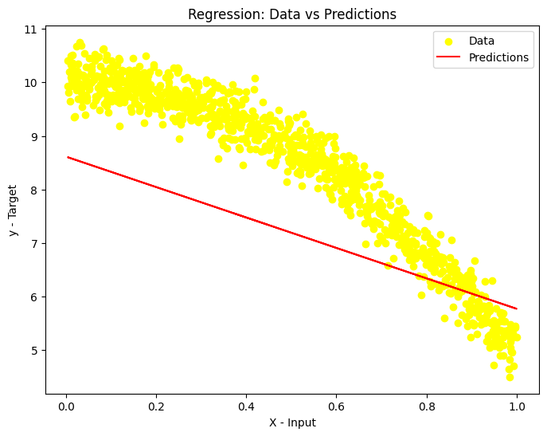

# Linear Regression from Scratch (NumPy) vs scikit-learn

Univariate linear regression implemented **without ML libraries**: data loading and visualisation, mean-squared-error loss, analytic gradients, a gradient-descent training loop, prediction, and a validation against `scikit-learn`.

## What it does
- `load_data` / `vis_data`: load a CSV and plot the relationship
- `loss`: MSE, with a unit test against a hand-computed value
- `gradients`: partial derivatives w.r.t. weight and bias, with a test (`dw=-2.0, db=-0.4` on the toy case)
- `train`: batch gradient descent, tracking loss per iteration
- `predict` + fit visualisation, then a `LinearRegression` baseline from scikit-learn for comparison

## Results
| Metric | Value |
|---|---|
| Initial loss | 72.96 |
| Final loss (gradient descent) | 1.81 |
| Learned weight / bias | -0.745 / 8.615 |
| scikit-learn R² | 0.901 |
| scikit-learn MSE | 0.235 |

**Limitations.** Single-feature, small dataset; no train/test split or regularisation (the point was to implement and verify the maths). The dataset file is not included here because it is course material.

## Skills demonstrated
NumPy vectorisation, gradient descent, loss and gradient derivation, unit-testing numerical code, model validation against scikit-learn, matplotlib / seaborn.

## Run
`pip install -r requirements.txt`, place your own `data.csv` next to the notebook, and run all cells.

## Context
Built as an individual assignment for the MSc in Artificial Intelligence & Machine Learning at the University of Adelaide (Concepts in AI & ML, 2025). Assignment brief text embedded in the notebook is the course's; the implementation and write-up are my own.

## Licence
MIT. See [LICENSE](LICENSE).
